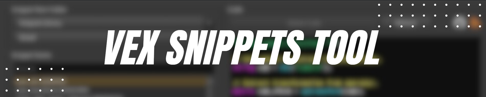

## 🚀 Installation

Let's get started! To install **VEXSnippetTool** and take advantage of its powerful features, follow these simple steps:

1. **Download** the `VEXSnippetTool` folder from this repository.
2. **Copy** the downloaded folder to the `$HOUDINI_USER_PREF_DIR` (`C:\Users\{Your User}\Documents\houdini{Your Houdini Version}`):
   > *Tip:* If you prefer, you can organize the folder inside subfolders, but make sure to remember the exact path for the next steps!

3. **Launch** Houdini.
4. Create a **Shelf** or use an existing one.
5. Add a new **Tool** and paste the following code in the `Script` tab (make sure to adjust the path according to your setup):
```python
import sys  
sys.path.append("Path where the VEXSnippetTool folder is located")  
   
from snippets import loadSnippet  
   
loadSnippet().show()
```

6. If you want to customize the **icon** of the tool, go to the `Options` tab and change the image. The default icon is available in:  
   `./VEXSnippetTool/images/loadsnippet.png`.


## ✨ Features

**VEXSnippetTool** is much more than just a tool. With its advanced features, it allows you to manage your VEX code in a more efficient way:

### 🌐 Libraries:
- **Online:** Access the *VEX Snippet Library* and automatically reload the snippets when they are updated.
- **Personal:** Create and organize your own snippets with full flexibility.

### ⚙️ Functionality:
- **New Code:** Easily add new snippets and customize their name, description, and type.
- **Text Editor:** Modify your code in the text editor and save changes with just a click.
- **Delete Code:** If you no longer need a snippet, you can delete it quickly.
- **Color Scheme:** Enjoy an optimized view with Houdini's default color scheme.
- **Wrangler Integration:** Add or replace code in the Houdini wrangler directly from the tool.
- **Direct Access to GitHub:** Open the *VEX Snippet Library* page from the GitHub button.
- **Connection Check:** Verify the internet connection to ensure you can reload snippets without issues.


## 💡 Important Notes

For a smoother experience, keep the following in mind:

- **Interface Update:** When creating, deleting, or modifying a code in the interface, it does not update immediately. This is intentional to protect your work, providing an additional layer of security. This way, you will always have the option to keep or revert your changes. Once you're sure, remember to **refresh the interface**.
- **Transferable Libraries:** Personal libraries are fully transferable. If you have a colleague with a more complete library, simply copy the `VEXSnippetTool` folder to the same path on your machine. *Keep in mind that this will overwrite your existing personal library!*
- **Editor without Autocomplete:** Currently, the editor does not have autocomplete. The ideal workflow is to write the code in a wrangler and then copy it into the editor.
- **Supported Wranglers:** The tool currently supports the following types of wranglers: `gaswrangle`, `attribwrangle`, `popwrangle`, and `geometrywrangle`. If you need more types, feel free to submit a request to add them!


## ⚠️ Known Issues
### v0.0.5
Here are some known issues. If you encounter any others, please report them on GitHub:
- **Latest Wifi Log:** The current no wifi version is not able to retrieve the latest saved VEX Snippet log.
  
### v0.0.4
Here are some known issues. If you encounter any others, please report them on GitHub:
- **Foreach Coloring:** The foreach coloring is not working correctly.

### v0.0.0
Here are some known issues. If you encounter any others, please report them on GitHub:

- **STMap:** The STMap code isn't capturing the title name correctly.
- **Refresh:** When refreshing, the snippet type and list reset, which causes the expected effect but creates the inconvenience of having to reselect the desired code.
- **Append Next Line Behavior:** When appending, the code is added to the wrangler jumping to the next line. This is the expected behavior, but when there isn't text, it jumps to the next line anyway.
- **Append Code Behavior:** When appending, the code is added to the first selected wrangler instead of the current selected.


Enjoy using **VEXSnippetTool** and take your Houdini projects to the next level! 🎉
